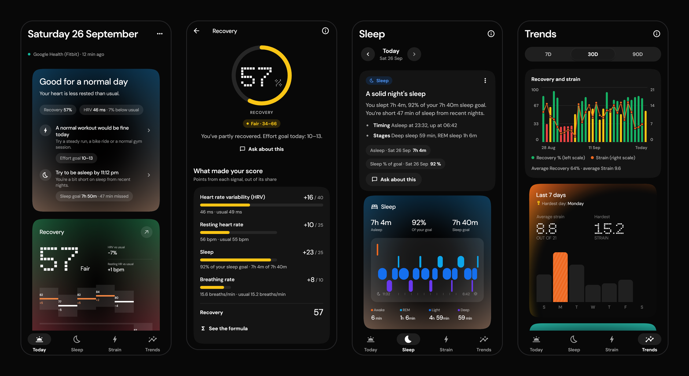
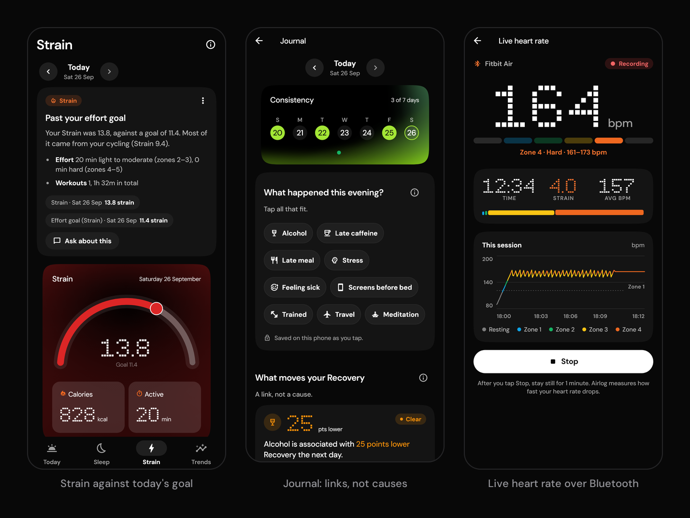
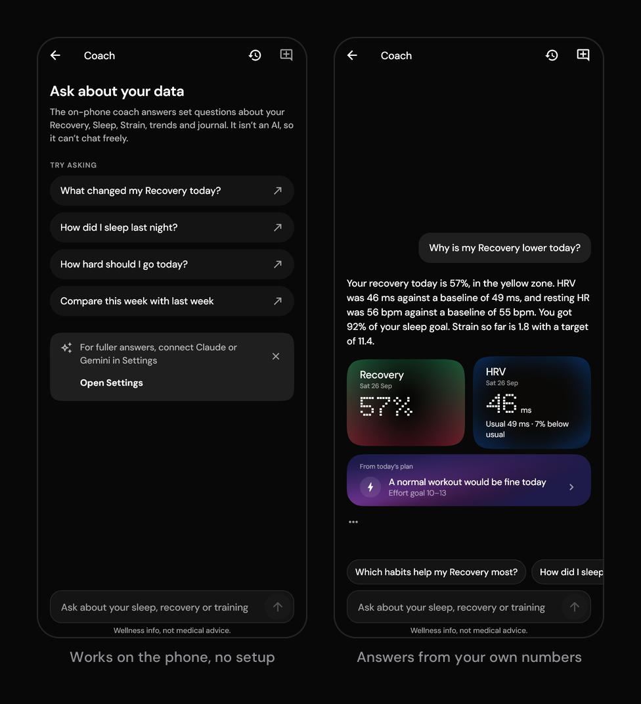
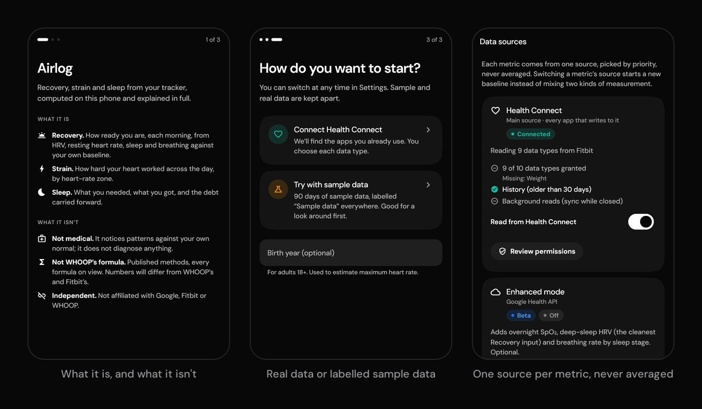

<!-- Author: add name + links -->

# Airlog

**One clear answer each morning: how you are, and what to do today. It's built from the wearable you already own and computed on your phone.**

Airlog is an Android app built in Flutter. It reads raw measurements from any wearable app through Health Connect and turns them into its own Recovery, Strain and Sleep scores. On top of those it adds a deterministic daily plan and an optional AI coach that can only cite your own data.

Built end to end on 90 days of sample data. Next milestone: field validation on the Fitbit Air.

[Product plan](PRODUCT_PLAN.md) · [Research](research/) · [Architecture](app/ARCHITECTURE.md) · [Coach evals](app/docs/EVALS.md) · [Build and run](app/README.md)

---

## The problem

In May 2026 Google replaced the Fitbit app with Google Health, and the reviews turned. A third-party analysis by [unstar.app](https://unstar.app/blog/fitbit-app-google-health-switch-sleep-sync-reviews-2026) read 3,349 one- to three-star Play reviews from June to mid-August 2026:

- 27.9 % were about the switch itself, not a bug.
- 11.3 % said a feature they used was gone or moved.
- 12.8 % said sleep tracking was inaccurate.
- 252 mentioned the AI features.

The AI coach drew some of the most repeated complaints. One r/fitbit post was titled "Nonstop lies from the AI". Users reported invented 5 am runs, a walk logged as a swim, and "sleep" during hours the band was off. In a TechRadar reader survey, only 20 % said they'd pay for the coach.

Android has few alternatives. As of September 2026, Welltory costs $12.99 a month, Sonar costs $5.99 a month, and Tawen is a $4.99 one-time, readiness-only app. The best-designed recovery apps (Bevel, Athlytic, Gentler Streak) are iOS-only. Sources and caveats: [research/04](research/04-user-sentiment.md) and [research/05](research/05-competitors.md).

**Who it's for**
- **Fitbit Air and Pixel Watch owners** who want a WHOOP-style morning read without Google Health's clutter or a subscription.
- **Samsung, Oura, WHOOP and Garmin users on Android** who want one explainable answer that works across devices.
- **People who want to see the maths.** Every score opens to its inputs, weights and baseline.

## Product thinking

### The insight

People aren't asking for more charts. They ask two questions each morning, "How am I?" and "What should I do today?", and they only act on the answer if they trust it. The complaints above are all trust failures: clutter, an AI that makes things up, scores stuck on "calibrating", and explanations behind a paywall.

### The one job

Everything serves "How am I + what to do." Today opens with a **TodayPlan**: the state in plain words, one sentence of why with the numbers behind it, zero to three concrete actions, and what the answer is based on. In the evening it switches to tonight. The plan is deterministic, and it's the only thing that narrates the day. Journal, Live workout and Coach sit in a secondary More menu.

### Principles

1. **Explainable.** Tap any score to see its inputs, their weights and how today compares with your baseline.
2. **Honest.** A missing input gets a status card that says what's missing and how to fix it. The app never guesses a number.
3. **Calm.** Today shows one answer, at most three actions, then the scores. No AI chatter.
4. **Private.** Scores are computed on the phone, with no server, no account and no analytics. The cloud coach is opt-in and says exactly what it sends.
5. **Owned.** Export your data and scores as CSV and JSON at any time.
6. **Derived, never invented.** Every number traces to a measurement from your own source app. Airlog never estimates one metric from another and shows it under the measured metric's name.

### How decisions get made

Every row in the [decisions log](PRODUCT_PLAN.md#7-decisions) carries a tag: **[U]** for my explicit call as product owner, **[R]** for research-backed, **[O]** for the orchestrating agent's choice. Explicit decisions and the principles beat looser phrasing, including my own later casual asks. When a [U] call collides with a principle, the [U] call sets the form and the principle sets the content.

For example, I asked for the UI to be a 1:1 copy of my Figma widget pack. Principle 6 still decided what fills each slot. Tiles that couldn't be filled honestly were relabelled with a measured metric or dropped: Stress Level, Wellness Score, Biological Age, a sleep-quality score, and the streak (now "Consistency, X of 7 days").

### Key decisions and trade-offs

| Decision | Why | What I gave up |
|---|---|---|
| **Our own scores, one formula for every device** | No sanctioned route exposes Google's Readiness or Sleep Score. One formula stays comparable across devices | Familiar vendor numbers |
| **Health Connect as the base, every app, one app per metric** | Free, with no cloud project, OAuth review or security audit | Gap-filling across apps. Mixing two apps' data in one metric was cut |
| **Never guess a missing signal** | A guessed number shown as a measurement breaks trust | Thinner scores for apps that share less, such as Samsung Health |
| **A grounded coach, not a chatbot** | I wanted Q&A over my own data, and hallucination is the top complaint about coaches | Build cost: a verifier, an output policy and an eval harness |
| **Model fallback stays inside one provider, then goes on-device** | Consent covers one provider, and a model's reasoning can't be handed to another mid-answer | No failover to the other provider |
| **Google Health API as an opt-in beta** | Its OAuth verification needs an annual CASA audit ($500–$4,500). Health Connect covers the core without it | Richer overnight data for most users, for now |
| **Flutter, not Kotlin and Compose** | Reuses existing Flutter chart and theme code, and keeps an iOS path open | First-party Health Connect SDK fidelity. One metric needs a small Kotlin bridge |

### Out of scope, on purpose

- **Scores built on estimates.** No fitness age from a heart-rate ratio and no strain without heart rate: every number is measured (principle 6).
- **An AI feed on Today.** Today gives one answer, and commentary would bury it (principle 3).
- **Customizable tiles and a catch-all Health tab.** A fixed, calm layout keeps the answer in the same place every morning.
- **LLM-written insight cards.** Cards stay deterministic, so every sentence can be checked against the data.
- **Food logging.** A different job from "How am I + what to do".
- **Vendor SDKs and paid relays.** They need partnerships or exclusive device access, or route data through a third-party cloud. Airlog stays on the phone (principle 4).

## The product

**Today, Recovery, Sleep and Trends** are in the hero above. Every score opens to its breakdown: the inputs, the points each one earned and your baseline.

**Coach.** On-device by default, or your own Claude or Gemini key. Every number carries a source chip, an answer that can't be checked becomes a plain facts table, and emergencies never reach a model.

Each render uses its own fixed sample day, so the coach shows Recovery 64 while the hero shows 78.

**Sources.** Onboarding says what the app is and isn't, then offers real data through Health Connect or clearly labelled sample data.

## How it works

When a wearable doesn't share a signal, Airlog says so and scores without it, never guessing. The scoring core is pure Dart, so it runs and is tested without a device, and every result is stamped with its algorithm version so history recomputes when a formula changes. Deep dive: [ARCHITECTURE.md](app/ARCHITECTURE.md).

## The coach: built for trust

Each provider also gets a daily budget (50 requests and 300k tokens by default) with a usage meter in Settings → Coach. Keys live in Android's keystore. Memory is a visible "What Coach knows" list, and nothing is saved without a "Remember this?" tap.

<b>All eval suites and results</b> (no network, no keys)

| Suite | Data | Result |
|---|---|---|
| Grounding, golden set | 48 questions (44 scored; 4 journal questions reported apart) | 44 / 44 verified; 361 / 361 claims supported |
| Hallucinating fake model | 88 cases: one number changed or one event invented | 88 / 88 caught, 0 shown to the user |
| Documented real-world failures | 9 probes: the swim that didn't happen, the invented 5 am run, band-off hours as a nap, missing data as zero … | 9 / 9 caught and replaced |
| Red-flag recall | 83 paraphrases | 83 / 83 routed; 44 / 44 urgent copy for emergencies and self-harm |
| Red-flag false positives | 85 benign questions, 49 of them near-misses | 0 / 85 (gate ≤ 2 %) |
| Output policy | 51 bad outputs; 55 good outputs | 51 / 51 caught; 0 / 55 false positives |
| Injection | 8 payloads × 3 channels | 24 / 24 on every check |
| Privacy invariants | Real Claude client bytes over a mock transport | 22 / 22 |
| Insight cards | Every template on all 90 sample days | 346 / 346 verified, policy-clean, in voice |
| TodayPlan | All 90 days, fresh and stale | 180 / 180 verified against the day's facts |
| On-device intent router | 34 questions | 34 / 34 right tool, arguments and grounded answer |

Treat them as regression gates, not field accuracy. The red-flag and policy detectors were tuned on these sets, which a separate author wrote. The scripted "hallucinating" model is simpler than a real model's failures, so the live benchmark comes next, through the same harness. Details: [EVALS.md](app/docs/EVALS.md).

## Design and quality

**Design.** The UI is a 1:1 build of my own Figma widget pack, dark only, and all 18 design tiles pass a pixel-diff test against the source design, each within its written limit. Where pixels and data disagreed, data won: one chart keeps a true linear scale (10.25 % diff) over an ordinal one that would have matched the design at 3.80 %. Motion stays under 300 ms and drops to zero under reduced motion. Touch targets are 48 dp, and tiles reflow at large text sizes. See [DESIGN_SYSTEM.md](app/docs/DESIGN_SYSTEM.md).

**Quality.**
- **Tests:** 1,019 passed in the last full local run, covering the engine, architecture boundaries, data on real SQLite, widgets and goldens, the pixel diffs and the eval suites.
- **Exploratory QA** on an emulator logged 21 issues. The worst was a P0: the background sync worker closed the app's shared database handle about every 15 minutes, which broke every screen. The worker now opens its own connection.
- **An independent review** by separate agents logged 19 deeper findings on persistence, provenance and coach privacy. [LAUNCH_READINESS](LAUNCH_READINESS.md) maps each one to its fix and to the device runs that come next.
- **Startup:** onboarding now appears 2.2–2.7 s after `main()` instead of 3.5–3.8 s, after a database read and background-job registration moved off the critical path (profile build, emulator).

## How I'd measure success

Everything here is a plan: targets and instrumentation, not results. Airlog has no analytics by design, so measurement relies on on-device counters the user can see, an opt-in usage summary, Play Console vitals and beta interviews.

**North Star: mornings answered.** Mornings per user per week where the TodayPlan is built from the user's own data, not sample data and not "waiting for data".

| Input metric | Why it matters | Planned target |
|---|---|---|
| Install → first real plan | Activation | Set from the first two weeks of beta data |
| Users reaching a full 14-night baseline | Scores stop being provisional | Set from beta data |
| Mornings with every score input present | Data quality, per source app | Tracked per app |
| Plan actions opened | The plan is used, not just read | Set from beta data |
| Coach answers verified without repair | Grounding quality with a real model | Live benchmark first, then the field |

| Guardrail | Threshold |
|---|---|
| Red-flag questions routed to safety copy | 100 % recall, false positives ≤ 2 % (eval gate) |
| Cloud sends without consent, or Google Health API data sent to a model | Zero (privacy suite) |
| Sample data shown without its label | Zero |
| First frame after launch | About 500 ms on a phone (QA target) |
| Crash and ANR rates | Play Console vitals, no worse than the category |

Release exit criteria come from the roadmap: stable, explainable scores on 2+ weeks of real data, and 2 weeks of my own daily use.

## What's next

| Milestone | What it involves |
|---|---|
| **Field-test on the Fitbit Air** | Confirm the band's data reaches Health Connect at the density the scores need, then pick the strain model that fits it |
| **Verify heart-rate density per app on real devices** | Samsung, Oura, WHOOP and Garmin, each with its own test fixture |
| **Benchmark live models against the eval suite** | Claude and Gemini through the same harness: pass rate, repair and fallback rates, cost per question |
| **Build the measured-value guard and add 8 more source apps** | Research found one app writes a profile setting where a measurement belongs. The guard keeps settings out of scores |
| **Complete Google OAuth verification** | Takes Enhanced mode (Google Health API) out of beta |
| **Morning HRV check with a chest strap (v1.1)** | Its feature flag is already reserved |
| **Launch on Google Play** | Health-apps declaration, data-safety form, production signing, device acceptance runs |
| **iOS version (plan ready)** | HealthKit, widgets, a workout Live Activity and Siri shortcuts, about 2.5–3.5 weeks ([IOS_PLAN](IOS_PLAN.md)) |
| **On-device models** | Gemini Nano for phrasing (v1.5), then Gemma after benchmarking (v2) |

## Harness engineering

Airlog is built by a multi-agent pipeline. These mechanisms keep parallel work consistent and every change honest.

| Mechanism | What it guarantees |
|---|---|
| **Decisions log with precedence tags** | [PRODUCT_PLAN §7](PRODUCT_PLAN.md#7-decisions) is the single source of truth. Every row is tagged [U], [R] or [O], and a written precedence rule settles conflicts |
| **Research → adversarial critic** | Key research passes get a critic review with binding vetoes ([09](research/09-hrv-workarounds.md) → [09b](research/09b-hrv-critique.md), [10](research/10-source-apps.md) → [10b](research/10b-source-apps-critique.md)), so guesses are cut before they reach code |
| **Spec-first contracts** | Shared domain files carry a `CONTRACT FILE` header: additive changes only, each one dated and reported |
| **One owner per file area** | Engine, data, UI and contracts each have a single owner ([ARCHITECTURE §9](app/ARCHITECTURE.md#9-ownership-the-build-agents)), so parallel edits don't collide |
| **Boundary tests** | A Flutter or plugin import in the domain, or a screen importing the data layer, fails the test suite |
| **Eval suites as regression gates** | Grounding, red-flag, policy, injection and privacy thresholds fail the suite on any regression |
| **Numeric checks on generated text** | Every TodayPlan and insight card is verified against the day's data on all 90 sample days (180/180 plan checks, 346/346 cards) |
| **Pixel-diff tests** | Each tile is diffed against its source design, and the comparator refuses to overwrite the design with a render |
| **Handoff notes** | Each workstream logs status, decisions and changed files as it goes, so work resumes cleanly after any interruption |
| **Shared heavy-job lock** | Builds, test runs and the emulator take one machine-wide lock, so parallel workstreams queue instead of overloading one laptop |

## Repo map

**Build and run:** follow [`app/README.md`](app/README.md). A fresh clone needs the Subway Ticker Grid font file placed by hand before the first build.

| Path | What's there |
|---|---|
| [`app/`](app/) | The Flutter app and its developer setup guide |
| [`PRODUCT_PLAN.md`](PRODUCT_PLAN.md) | Research synthesis, principles, roadmap, risks and the tagged decisions log |
| [`research/`](research/) | User sentiment, competitors, data access, AI coaches and source apps, plus the critic reviews |
| [`app/ARCHITECTURE.md`](app/ARCHITECTURE.md) | Layers, data flow, sync, source priority and the coach pipeline |
| [`app/docs/EVALS.md`](app/docs/EVALS.md) | Coach guardrails, eval suites, thresholds and the live benchmark harness |
| [`app/docs/DESIGN_SYSTEM.md`](app/docs/DESIGN_SYSTEM.md) | Tokens, tiles, pixel-diff tests and motion rules |
| [`app/docs/QA_REPORT.md`](app/docs/QA_REPORT.md), [`APP_REVIEW.md`](APP_REVIEW.md), [`LAUNCH_READINESS.md`](LAUNCH_READINESS.md) | QA findings, the independent review and the release gates |
| [`IOS_PLAN.md`](IOS_PLAN.md) | The iPhone plan |
| [`docs/readme/`](docs/readme/) | The images on this page. `build_images.py` regenerates the screenshots from the app's goldens |
