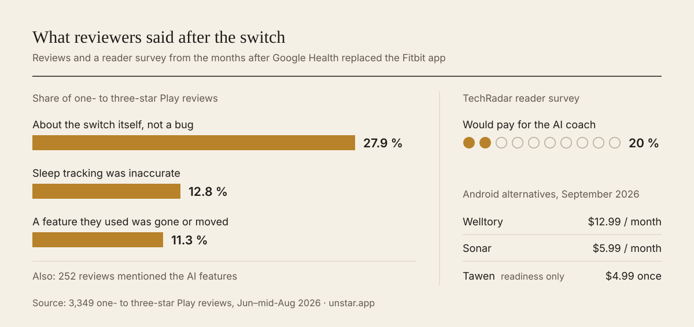
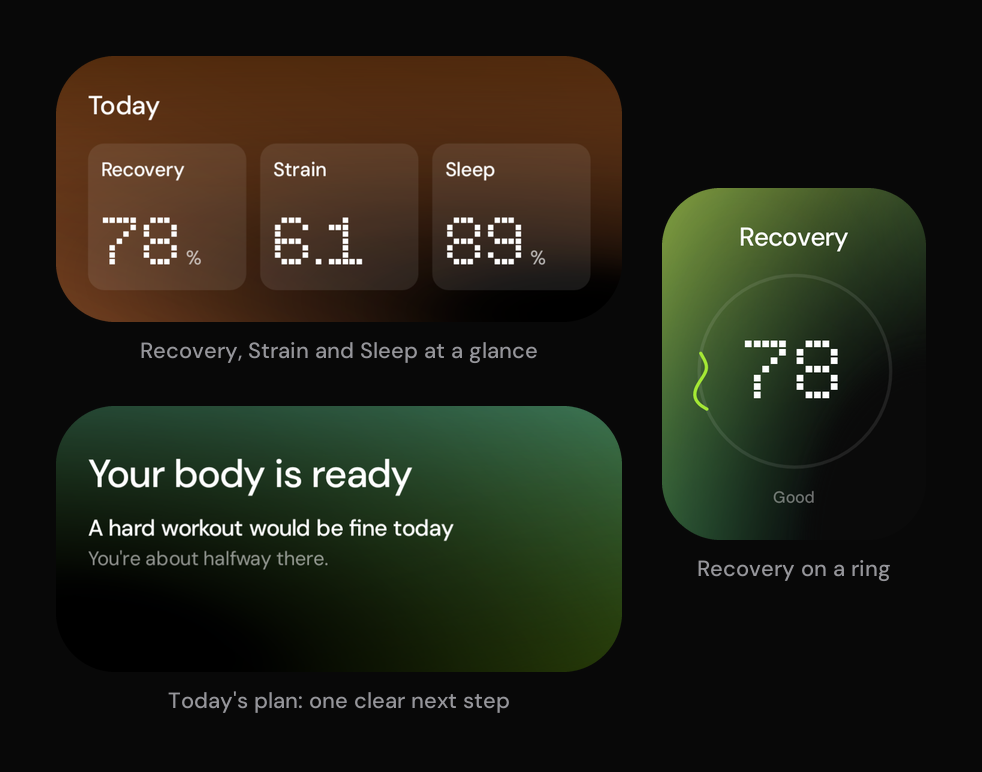

# Airlog

**One clear answer each morning: how you are, and what to do today. It's built from the wearable you already own and computed on your phone.**

**[▶ Watch the launch film with sound](https://github.com/A2K2005/airlog/releases/download/v1.0.0/airlog-launch-film.mp4)** (25 s, MP4) · **[Download the Android app (APK)](https://github.com/A2K2005/airlog/releases/latest)** · Android 8.0 or newer

Airlog is an Android app built in Flutter. It reads raw measurements from any wearable app through Health Connect and turns them into its own Recovery, Strain and Sleep scores. On top of those it adds a deterministic daily plan and an optional AI coach that can only cite your own data.

Built end to end. Next milestone: field validation on the Fitbit Air.

[Product plan](PRODUCT_PLAN.md) · [Research](research/) · [Architecture](app/ARCHITECTURE.md) · [Build and run](app/README.md)

---

## The problem

In May 2026 Google replaced the Fitbit app with Google Health, and the reviews turned, according to a third-party analysis by [unstar.app](https://unstar.app/blog/fitbit-app-google-health-switch-sleep-sync-reviews-2026). The AI coach drew some of the most repeated complaints: one r/fitbit post was titled "Nonstop lies from the AI", and users reported invented 5 am runs, a walk logged as a swim, and "sleep" during hours the band was off.

Android has few alternatives, and the best-designed recovery apps (Bevel, Athlytic, Gentler Streak) are iOS-only. Sources and caveats: [research/04](research/04-user-sentiment.md) and [research/05](research/05-competitors.md).

**Who it's for**
- **Fitbit Air and Pixel Watch owners** who want a WHOOP-style morning read without Google Health's clutter or a subscription.
- **Samsung, Oura, WHOOP and Garmin users on Android** who want one explainable answer that works across devices.
- **People who want to see the maths.** Every score opens to its inputs, weights and baseline.

## Product thinking

### The insight

People aren't asking for more charts. They ask two questions each morning, "How am I?" and "What should I do today?", and they only act on the answer if they trust it. The complaints above are all trust failures: clutter, an AI that makes things up, scores stuck on "calibrating", and explanations behind a paywall.

### The one job

Everything serves "How am I + what to do." Today opens with a **TodayPlan**: the state in plain words, one sentence of why with the numbers behind it, zero to three concrete actions, and what the answer is based on. In the evening it switches to tonight. The plan is deterministic, and it's the only thing that narrates the day. Journal, Live workout and Coach sit in a secondary More menu.

### Principles

1. **Explainable.** Tap any score to see its inputs, their weights and how today compares with your baseline.
2. **Honest.** A missing input gets a status card that says what's missing and how to fix it. The app never guesses a number.
3. **Calm.** Today shows one answer, at most three actions, then the scores. No AI chatter.
4. **Private.** Scores are computed on the phone, with no server, no account and no analytics. The cloud coach is opt-in and says exactly what it sends.
5. **Owned.** Export your data and scores as CSV and JSON at any time.
6. **Derived, never invented.** Every number traces to a measurement from your own source app. Airlog never estimates one metric from another and shows it under the measured metric's name.

### How decisions get made

Every row in the [decisions log](PRODUCT_PLAN.md#7-decisions) carries a tag: **[U]** for my explicit call as product owner, **[R]** for research-backed, **[O]** for the orchestrating agent's choice. Explicit decisions and the principles beat looser phrasing, including my own later casual asks. When a [U] call collides with a principle, the [U] call sets the form and the principle sets the content.

For example, I asked for the UI to be a 1:1 copy of my Figma widget pack. Principle 6 still decided what fills each slot. Tiles that couldn't be filled honestly were relabelled with a measured metric or dropped: Stress Level, Wellness Score, Biological Age, a sleep-quality score, and the streak (now "Consistency, X of 7 days").

### Key decisions and trade-offs

| Decision | Why | What I gave up |
|---|---|---|
| **Our own scores, one formula for every device** | No sanctioned route exposes Google's Readiness or Sleep Score. One formula stays comparable across devices | Familiar vendor numbers |
| **Health Connect as the base, every app, one app per metric** | Free, with no cloud project, OAuth review or security audit | Gap-filling across apps. Mixing two apps' data in one metric was cut |
| **Never guess a missing signal** | A guessed number shown as a measurement breaks trust | Thinner scores for apps that share less, such as Samsung Health |
| **A grounded coach, not a chatbot** | I wanted Q&A over my own data, and hallucination is the top complaint about coaches | Build cost: a verifier and an output policy |
| **The coach opens straight to chat** | A setup screen stood between the user and the first answer. On-phone answers work at once, and a cloud key only makes them fuller | A consent step up front; the cloud choice now lives in Settings |
| **Onboarding hands off to Android's own permission sheet** | Health Connect's sheet already lists every data type with a toggle, so a second list in the app was pure friction | Room to explain each data type before the prompt |
| **Model fallback stays inside one provider, then goes on-device** | Consent covers one provider, and a model's reasoning can't be handed to another mid-answer | No failover to the other provider |
| **Google Health API as an opt-in beta** | Its OAuth verification needs an annual CASA audit ($500–$4,500). Health Connect covers the core without it | Richer overnight data for most users, for now |
| **Flutter, not Kotlin and Compose** | Reuses existing Flutter chart and theme code, and keeps an iOS path open | First-party Health Connect SDK fidelity. One metric needs a small Kotlin bridge |

### Out of scope, on purpose

- **Scores built on estimates.** No fitness age from a heart-rate ratio and no strain without heart rate: every number is measured (principle 6).
- **An AI feed on Today.** Today gives one answer, and commentary would bury it (principle 3).
- **Customizable tiles and a catch-all Health tab.** A fixed, calm layout keeps the answer in the same place every morning.
- **LLM-written insight cards.** Cards stay deterministic, so every sentence can be checked against the data.
- **Food logging.** A different job from "How am I + what to do".
- **Vendor SDKs and paid relays.** They need partnerships or exclusive device access, or route data through a third-party cloud. Airlog stays on the phone (principle 4).

## The product

**Strain, Journal and Live.** Every score opens to its breakdown: the inputs, the points each one earned and your baseline. The Journal links evening habits to next-day Recovery, and a live workout reads heart rate straight from the band over Bluetooth.

**Coach.** Opens straight to the chat: on-device answers work with no setup, and your own Claude or Gemini key makes them fuller. Every number is checked against your data before you see it, and the answer's ⋯ menu shows where each one came from. An answer that can't be checked becomes a plain facts table, and emergencies never reach a model.

**Home-screen widgets.** The day at a glance without opening the app: Recovery, Strain and Sleep side by side, today's plan with its one next step, and Recovery on a ring. They refresh after every sync.

## How it works

When a wearable doesn't share a signal, Airlog says so and scores without it, never guessing. The scoring core is pure Dart, so it runs without a device, and every result is stamped with its algorithm version so history recomputes when a formula changes. Deep dive: [ARCHITECTURE.md](app/ARCHITECTURE.md).

## The coach: built for trust

Each provider also gets a daily budget (50 requests and 300k tokens by default) with a usage meter in Settings → Coach. Keys live in Android's keystore. Memory is a visible "What Coach knows" list, and nothing is saved without a "Remember this?" tap.

## Design and quality

**Design.** The UI is a 1:1 build of my own Figma widget pack, dark only. Where pixels and data disagreed, data won: one chart keeps a true linear scale over an ordinal one that would have matched the design more closely. Motion stays under 300 ms and drops to zero under reduced motion. Touch targets are 48 dp, and tiles reflow at large text sizes. See [DESIGN_SYSTEM.md](app/docs/DESIGN_SYSTEM.md).

**Quality.**
- **Copy and honesty review:** a 328-item review moved the app to plain words and fixed six places where the text claimed more than the data showed, such as an on-phone coach reply that guessed the band was charging when nothing had been recorded.
- **Exploratory QA** on an emulator logged 21 issues. The worst was a P0: the background sync worker closed the app's shared database handle about every 15 minutes, which broke every screen. The worker now opens its own connection.
- **An independent review** by separate agents logged 19 deeper findings on persistence, provenance and coach privacy. [LAUNCH_READINESS](LAUNCH_READINESS.md) maps each one to its fix and to the device runs that come next.
- **Startup:** onboarding now appears 2.2–2.7 s after `main()` instead of 3.5–3.8 s, after a database read and background-job registration moved off the critical path (profile build, emulator).

## How I'd measure success

Airlog has no analytics by design, so measurement relies on on-device counters the user can see, an opt-in usage summary, Play Console vitals and beta interviews.

Release exit criteria come from the roadmap: stable, explainable scores on 2+ weeks of real data, and 2 weeks of my own daily use.

## What's next

| Milestone | What it involves |
|---|---|
| **Field-test on the Fitbit Air** | Confirm the band's data reaches Health Connect at the density the scores need, then pick the strain model that fits it |
| **Verify heart-rate density per app on real devices** | Samsung, Oura, WHOOP and Garmin |
| **Benchmark live models** | Claude and Gemini on real questions: how often answers pass the checks, need a repair or fall back, and cost per question |
| **Build the measured-value guard and add 8 more source apps** | Research found one app writes a profile setting where a measurement belongs. The guard keeps settings out of scores |
| **Complete Google OAuth verification** | Takes Enhanced mode (Google Health API) out of beta |
| **Morning HRV check with a chest strap (v1.1)** | Its feature flag is already reserved |
| **Launch on Google Play** | Health-apps declaration, data-safety form, production signing, device acceptance runs |
| **iOS version (plan ready)** | HealthKit, widgets, a workout Live Activity and Siri shortcuts, about 2.5–3.5 weeks ([IOS_PLAN](IOS_PLAN.md)) |
| **On-device models** | Gemini Nano for phrasing (v1.5), then Gemma after benchmarking (v2) |

## Harness engineering

Airlog is built by a multi-agent pipeline. These mechanisms keep parallel work consistent and every change honest.

| Mechanism | What it guarantees |
|---|---|
| **Decisions log with precedence tags** | [PRODUCT_PLAN §7](PRODUCT_PLAN.md#7-decisions) is the single source of truth. Every row is tagged [U], [R] or [O], and a written precedence rule settles conflicts |
| **Research → adversarial critic** | Key research passes get a critic review with binding vetoes ([09](research/09-hrv-workarounds.md) → [09b](research/09b-hrv-critique.md), [10](research/10-source-apps.md) → [10b](research/10b-source-apps-critique.md)), so guesses are cut before they reach code |
| **Spec-first contracts** | Shared domain files carry a `CONTRACT FILE` header: additive changes only, each one dated and reported |
| **One owner per file area** | Engine, data, UI and contracts each have a single owner ([ARCHITECTURE §9](app/ARCHITECTURE.md#9-ownership-the-build-agents)), so parallel edits don't collide |
| **Handoff notes** | Each workstream logs status, decisions and changed files as it goes, so work resumes cleanly after any interruption |
| **Shared heavy-job lock** | Builds and the emulator take one machine-wide lock, so parallel workstreams queue instead of overloading one laptop |

## Repo map

**Build and run:** follow [`app/README.md`](app/README.md).

| Path | What's there |
|---|---|
| [`app/`](app/) | The Flutter app and its developer setup guide |
| [`PRODUCT_PLAN.md`](PRODUCT_PLAN.md) | Research synthesis, principles, roadmap, risks and the tagged decisions log |
| [`research/`](research/) | User sentiment, competitors, data access, AI coaches and source apps, plus the critic reviews |
| [`app/ARCHITECTURE.md`](app/ARCHITECTURE.md) | Layers, data flow, sync, source priority and the coach pipeline |
| [`app/docs/DESIGN_SYSTEM.md`](app/docs/DESIGN_SYSTEM.md) | Tokens, tiles and motion rules |
| [`app/docs/QA_REPORT.md`](app/docs/QA_REPORT.md), [`APP_REVIEW.md`](APP_REVIEW.md), [`LAUNCH_READINESS.md`](LAUNCH_READINESS.md) | QA findings, the independent review and the release gates |
| [`IOS_PLAN.md`](IOS_PLAN.md) | The iPhone plan |
| [`docs/readme/`](docs/readme/) | The images on this page |
